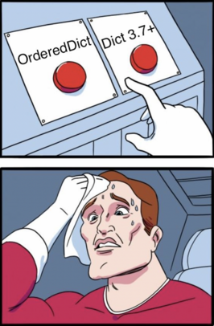

## Python Dictionaries Now Keep Insertion Order

An implementation detail in `python 3.6` and now a language feature in `python 3.7+`, python's regular `dict` now **retains insertion order**.

[Message](https://mail.python.org/pipermail/python-dev/2017-December/151283.html) from Guido van Rossum:
> Make it so. "Dict keeps insertion order" is the ruling. Thanks!

From the python 3.7 [release highlights](https://docs.python.org/3/whatsnew/3.7.html#:~:text=the%20insertion%2Dorder%20preservation%20nature%20of%20dict%20objects%20has%20been%20declared%20to%20be%20an%20official%20part%20of%20the%20Python%20language%20spec.):
> the insertion-order preservation nature of dict objects has been declared to be an official part of the Python language spec.

Demo:
```py
d = {}
d['a'] = 1
d['b'] = 2
d['c'] = 3
d['d'] = 4
for key, value in d.items():
    print(key, value)
```
You can expect the above code block to always print this:
```
a 1
b 2
c 3
d 4
```

So what is the point of `OrderedDict` now if the regular `dict` can keep insertion order?


## OrderedDict Is Still Useful

Even with the new changes, regular `dict` doesn't really replace `OrderedDict`.

### Breaking Code
Relying on this new feature will cause code to break on earlier versions of python. When we typically talk about python we are usually talking about the [CPython](https://www.python.org/) implementation but there are also many [different implementations](https://wiki.python.org/moin/PythonImplementations). Your code will also break on implementations that haven't caught up to the CPython 3.7 implementation.

### Declaring Intent

Using `OrderedDict` over `dict` makes it clear to other people that the order of dictionary items is important.

### Equality
The equality comparisons for `OrderedDict` is order sensitive while this is still not the case for the regular `dict` (as of python 3.9).

```py
>>> dict([(1,2), (2,3)]) == dict([(2,3), (1,2)])
True
>>> OrderedDict([(1,2), (2,3)]) == OrderedDict([(2,3), (1,2)])
False
```

### Other Functionalities

The `OrderedDict` also has a `move_to_end()` method.

From the python `OrderedDict` [documentation](https://docs.python.org/3/library/collections.html#:~:text=OrderedDict%20has%20a%20move_to_end,the%20leftmost%20(first)%20position):
> OrderedDict has a move_to_end() method to efficiently reposition an element to an endpoint.

> A regular dict does not have an efficient equivalent for OrderedDict’s od.move_to_end(k, last=False) which moves the key and its associated value to the leftmost (first) position.

`reversed()` for regular python `dict` didn't exist until python 3.8 see [docs](https://docs.python.org/3/library/collections.html#:~:text=Until%20Python%203.8%2C%20dict%20lacked%20a%20__reversed__()%20method.)

## Conclusion

The new `dict` doesn't really replace `OrderedDict`. Adoption of new features is also a slow process so it might take a while before this feature becomes the widely used.